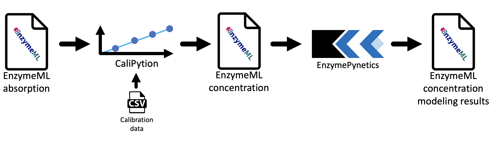

# Results

In this work, two Python modules were developed, which build the components of an analysis workflow for kinetic parameter estimation. The workflow facilitates kinetic parameter estimation for enzyme reactions, which are based on time-course measurements. Starting from raw data of photometric measurements, which are stored in a EnzymeML document, concentration values were calculated by CaliPytion, whereupon kinetic parameters were determined by EnzymePynetics. A key aspect of the workflow design was to enable reproducible analysis. Therefore, documentation of raw data treatment prior to modeling is vital. As a result, Jupyter Notebooks were used as a platform, since they allow to write text and code within the same document. In consequence, data analysis as well as documentation of data analysis are unified within the same document. Ultimately, each data treatment step from raw data to kinetic parameters is comprehensively documented.  
The developed workflow is build around the EnzymeML data model, which structures measurement data, reaction conditions, reaction components, as well as kinetic parameters of a biocatalytic experiment. Together with the associated Python library PyEnzyme, the final modeling results are integrated in the EnzymeML document, whereupon the document is saved as a valid EnzymeML file. The developed workflow is schematically visualized in figure 1.

_Fig. 1: Workflow for kinetic parameter estimation of enzyme reactions._

#TODO uptade figure

## CaliPytion

CaliPytion was developed to facilitate robust conversion of measurement data to concentration data. Based on an analyte standard, a calibration curve is created. Since linear and non-linear relations between analyte concentration and analytic signal may occur, {cite}`hsu2010effect`, {cite}`martin2017fitting`, linear, polynomial, exponential, and rational calibration equations were implemented. After fitting, the best model is preselected based on Akaike information criterion {cite}`akaike1998information`, offering a metric to compare models with different number of parameters. Thereby, AIC describes the information loss relative to alternative models, while penalizing the use of additional parameters. CaliPytion was designed to work with PyEnzyme. Hence, a `StandardCurve` of CaliPytion can natively by applied to an `EnzymeMLDocument` of PyEnzyme. As a result, absorption data of an EnzymeML document can be converted into concentration data based on the previously generated standard curve.

## EnzymePynetics

EnzymePynetics was developed to enable easy applicable parameter estimation of single substrate enzyme reaction directly from EnzymeML documents. In it's core, the `ParameterEstimator` of EnzymePynetics fits experimental data to different Michaels-Menten type models. Besides the irreversible Michaelis-Menten model, competitive, non-competitive, uncompetitive, and partially competitive inhibition models were implemented. Hence, the inhibition constant of potentially inhibiting substrate or product can be estimated. Furthermore, the inhibition constant of an applied inhibitor can be quantified. Since, the experimental data is fitted against multiple kinetic models, the best fitting model is suggested based on AIC. Hence, a proposal of the enzyme's kinetic mechanism is given based on the best fitting model.
For quality control, visualization of experimental data as well as the fitted kinetic model was a priority during development. Thereby, detection of systematic deviation between model and measurement data is possible. In consequence, potential experimental errors can be identified. Furthermore, the `ParameterEstimator` allows to subset the measurement data by time as well as initial substrate concentration without deleting data. Hence, identified systematic deviations (e.g. lag-phases or measurements with incorrect enzyme concentrations) can be excluded from parameter estimation.  
Like the `StandardCurve` of CaliPytion, the `ParameterEstimator` of EnzymePynetics natively supports `EnzymeMLDocument`s as a data source.

By combining CaliPytion and EnzymePynetics together with EnzymeML, a robust workflow for reproducible enzyme kinetics was developed within an Jupyter Notebook environment.

## Scenario-driven workflow development

The development of the workflow was driven by different research scenarios of EnzymeML project partners. Goal of all projects was to reliably determine kinetic parameters of enzyme reactions.
The collaboration consisted of multiple rounds of lab experiments (preformed by the experimental partners) and kinetic modeling of the experimental data. Each round consisted of (i) wet lab experiments, (ii) kinetic modeling, (iii) design of follow-up experiments, and (iv) discussion of results with the respective project partners. Hence, a short feedback loop between lab experiments and modeling-based experimental suggestions was established.  
In parallel, the python modules CaliPytion and EnzymePynetics were developed. Thereby, individual requirements of each research scenario fostered the implementation of various functionalities, resulting in a feature-rich yet generic workflow.

## Reproducible data analysis with Jupyter Notebook and Book

Jupyter Notebooks form an ideal environment for scientific data analysis. Besides the mentioned documentation capabilities, notebooks can be uploaded to platforms like GitHub or be deployed with Binder {cite}`ragan2018binder`. GitHub is a cloud-based Git repository, which enables versioning as well as collaborative working on code projects. Sharing of Jupiter Notebooks is possible with the open-source project Binder, which allows hosting of notebooks.
In result, Jupyter Notebooks, which are executable through Binder, form a user-friendly environment for scientific data analysis. Due to the extensive documentation capabilities of Jupyter Notebooks, the analysis workflow is comprehensible and accessible for non-programmers.

The following chapters of this work demonstrate the capabilities of Jupyter Notebooks as well as those of the developed workflow. All shown research scenarios are executed Jupyter Notebooks with the implemented workflow for enzyme kinetics. Hence all figures and tables for data visualization were generated at runtime of the analysis.
Every notebook consists of a short description of the project's background and methodology carried out by the project partners in the wet lab. Additionally, data preparation, kinetic modeling steps, as well as the results are shown and project specific results are discussed.
All notebooks can be launched interactively by clicking on the rocket icon in the upper section of each scenario page.
In result, FAIR data compliant data analysis was established.

Besides the data analysis, this entire thesis was conceptualized adhering to FAIR data principles. In consequence, this thesis was written was a Jupyter Book, which allow to combine multiple Jupyter Notebooks with text chapters in a structured document. Ultimately, this thesis is findable and accessible on GitHub, interoperable through Binder and the Jupyter Notebook format itself. Hence, making the work of this thesis reusable.
